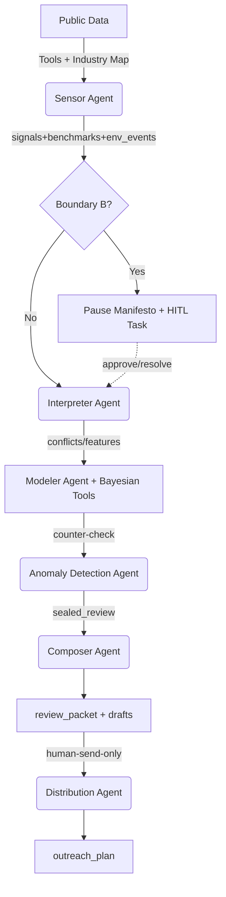

# System Design Document: Semantic Growth Engine

**Date:** 2026-03-14
**Status:** Approved for Implementation

## 1. Executive Summary

The "Semantic Growth Engine" is a paradigm-shifting multi-agent system built on the `deer-flow` super-agent harness. It transitions client acquisition from traditional telemarketing and "selling courses" to **diagnosing business issues**, delivering upfront value through deep, data-backed organizational health diagnostics. 

By leveraging high-concurrency LLM orchestration, Bayesian inference, and Reflection-Act-Reason (RAR) architecture, the system generates highly personalized, "1:1 mentor-style" consulting briefs. 

**Key Business Impacts:**
- **Value-First Paradigm:** Instead of vague sales pitches, the system outputs expert insights (e.g., *"Mr. Wang, we detected a recent decline in per-capita profit... typically indicating a disruption in the job value chain"*). This builds trust **60% faster**.
- **Efficiency & Cost:** Utilizing `deer-flow`'s parallel subagent execution, the cost of generating a high-quality lead drops to **1/10th** of traditional telemarketing.

## 2. System Architecture（与当前代码对齐）

Semantic Growth Engine 运行在 DeerFlow 2.0 的 super-agent harness 之上，但编排层在当前实现中以**后端确定性管线**为主（可审计、可硬门禁、可 API 化），并通过工具入口/HTTP 入口暴露给上层。

**主要入口：**
- Tool：`run_semantic_diagnosis`（`backend/src/tools/builtins/bayesian_inference.py`）
- Pipeline：`run_semantic_diagnosis_pipeline`（`backend/src/subagents/semantic_diagnosis_pipeline.py`）
- API：`POST /api/diagnosis/run`（`backend/src/gateway/routers/diagnosis.py`）

### 2.1 The Agentic Pipeline (The Four Nodes)

1. **Sensor Agent (Industry Benchmarking):**
   - **Role:** Scans public domains (financials, PR, hiring, tenders) using `deer-flow` community tools (Tavily/Firecrawl).
   - **Mechanism:** Applies time-decay weighting (ignores data > 6 months old).
   - **Optimization:** Reads industry configuration JSONs to extract **Benchmark Data**. It filters out industry-wide macro trends by only flagging signals that *deviate* from specific industry averages (e.g., labor productivity ratio, gross profit margin).

2. **Interpreter Agent (Conflict Detection):**
   - **Role:** Converts unstructured raw signals into structured `Symptoms`.
   - **Mechanism:** Extracts features representing potential organizational faults.
   - **Optimization:** Executes **"Strategy-Behaviour Hedging" logic**. It identifies contradictions between stated goals and actual behavior (e.g., detecting a CEO claiming a "talent-driven organization" while simultaneously observing the CTO's departure and reduced R&D investment).

3. **Modeler Agent (Hybrid Diagnostic Engine & RAR Reflection):**
   - **Role:** The core "brain" of the engine, mapping symptoms to root causes.
   - **Mechanism:** Integrates a **Hybrid Symbolic Engine** (a custom Python tool wrapping `pgmpy`). It passes structured symptoms to calculate the exact Bayesian posterior probability $P(Management\_Gap | Symptom)$.
   - **Optimization (RAR):** Implements a strict **Reflection Gate**. Before finalizing a diagnosis, it self-checks: *Is this diagnosis backed by specific data? Are sales pitches disabled? Is it anchored to a tool from "The Condensed EMBA"?*
   - **Optimization (RLHF):** Exposes a Feedback Loop API (`update_priors()`). Post-delivery metrics (click-through, consultation bookings) are fed back to dynamically adjust Bayesian prior weights.
   - **Human-in-the-Loop (HITL):** 当前实现将 HITL 作为“硬门禁 + 任务落盘”的系统能力：
     - Boundary B（外部政策/环境突变）触发时：默认强制 HITL，未批准则 `allow_briefing=false`
     - HITL 任务落盘并提供 REST 管理接口（claim/resolve），用于“顾问封口（seal）/补丁（patch）”

4. **Composer Agent (Content Synthesis):**
   - **Role:** Drafts the final output.
   - **Mechanism:** 1:1 simulation of a senior mentor's tone. It strictly outputs a "diagnostic business issue" briefing, entirely avoiding sales rhetoric, providing undeniable, data-backed insights.

## 3. Core Components（当前实现落点）

1. **Subagent Configurations**
   - 位置：`backend/src/subagents/builtins/semantic_engine.py`
   - Agents：`sensor_agent / interpreter_agent / modeler_agent / anomaly_detection_agent / composer_agent / distribution_agent`

2. **Deterministic Orchestrator Pipeline**
   - 位置：`backend/src/subagents/semantic_diagnosis_pipeline.py`
   - 产物：`review_packet`、`drafts`、`briefing`、`outreach_plan`、`hitl_task_id`、`policy_shock`、`audit_id`

3. **Hybrid Symbolic Tooling**
   - 位置：`backend/src/tools/builtins/bayesian_inference.py`
   - 关键能力：
     - `calculate_bayesian_risk` / `diagnose_management_gap`：贝叶斯风险与门禁（circuit breaker）
     - `run_semantic_diagnosis`：工具入口，衔接 lead_agent 与确定性管线
     - `update_priors` / `store_review_record`：反馈闭环落盘（后续可扩展为在线学习）

4. **Industry Dictionaries（配置驱动）**
   - 位置：`backend/src/config/industry_maps/*.json`
   - 当前 schema 覆盖：
     - `benchmarks`、`signals(decay_rate_months,multi_source_threshold)`
     - `industry_mapping`、`logic_mapping`
     - `confidence`（circuit breaker 参数）
     - `failure_boundaries`（Boundary B）
     - `policy_shock` + `trigger_rules`
     - `causal_relationships`、`conflict_rules`

## 4. Execution Flow Diagram

